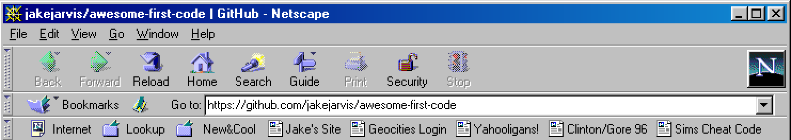

# Awesome First Code 

I recently published my terrible, horrible, no good, very bad [first HTML site](https://jarv.is/y2k) and [first PHP project](https://github.com/jakejarvis/jbb#readme) ever and developed a new addiction to Web 1.0 nostalgia, fed by others who were brave enough to do the same. (I'm trying very hard to make this a cool trend, if you couldn't tell!)

This repository was originally aimed towards those of us who grew up in the Geocities and FrontPage and Macromedia Flash era, but coders of all ages are welcome to dust off that floppy disk or 256MB USB thumb drive (or the [Wayback Machine](https://archive.org/web/), if you can remember your first screen name 😬) and commit your first projects unmodified to GitHub for posterity — and proudly [link to them](https://github.com/jakejarvis/awesome-first-code/edit/master/readme.md) here!

If you see your name here and didn't add it, it's because I've done a few quick searches of GitHub for phrases like "my first website" and "first project 1999." Feel free to [remove yourself](https://github.com/jakejarvis/awesome-first-code/edit/master/readme.md) via a pull request if you don't wish to be listed and I'll accept it immediately. (But I beg you not to do this purely out of embarrassment — the purpose of this is to be proud of how far you've come since then!)

**\*** = non-English project

## First HTML

- [jakejarvis/y2k](https://github.com/jakejarvis/y2k)
- [JamesIves/tooncrazy](https://github.com/JamesIves/tooncrazy)
- [aquova/my-first-website](https://github.com/aquova/my-first-website)
- [chesleybrown/gonzellcomics](https://github.com/chesleybrown/gonzellcomics)
- [noopkat/pokemonshack](https://github.com/noopkat/pokemonshack)
- [olivierlacan/Stratego-v1](https://github.com/olivierlacan/Stratego-v1)
- [sartaj/before-i-was-me](https://github.com/sartaj/before-i-was-me)
- [elisav/Homepage-2001](https://github.com/elisav/Homepage-2001)
- [maning/geocities](https://github.com/maning/geocities)
- [egillespie/first-webpage](https://github.com/egillespie/first-webpage)
- [maxedmands/foozle](https://github.com/maxedmands/foozle)
- [JamesMcGuigan/starsfaq.com](https://github.com/JamesMcGuigan/starsfaq.com)
- [robstarbuck/employboy](https://github.com/robstarbuck/employboy)
- [olivierlacan/Stratego-v1](https://github.com/olivierlacan/Stratego-v1)
- [Tusk98/WebsiteFrom98](https://github.com/Tusk98/WebsiteFrom98)
- [huan/zhuohuan](https://github.com/huan/zhuohuan)
- [darrenmothersele/permaphalt](https://github.com/darrenmothersele/permaphalt)
- [zorfling/chickenland](https://github.com/zorfling/chickenland)
- [midzer/my-first-website](https://github.com/midzer/my-first-website) **\***
- [dvfernandes/firstwebsite](https://github.com/dvfernandes/firstwebsite) **\***
- [davialexandre/my-first-homepage](https://github.com/davialexandre/my-first-homepage) **\***
- [gazpachu/pachu](https://github.com/gazpachu/pachu) **\***
- [eduardozulian/poisonapple](https://github.com/eduardozulian/poisonapple) **\***
- [javve/my-first-html-page-ever-1998-04-22](https://github.com/javve/my-first-html-page-ever-1998-04-22) **\***

## First PHP

- [jakejarvis/jbb](https://github.com/jakejarvis/jbb)
- [m4tthumphrey/legacies](https://github.com/m4tthumphrey/legacies)
- [donniereese/Bloggerfish](https://github.com/donniereese/Bloggerfish)
- [surma-dump/smileygenerator](https://github.com/surma-dump/smileygenerator)
- [rypalmer/panthertv-stats](https://github.com/rypalmer/panthertv-stats)
- [Sameh-R-Labib/complete_app_one](https://github.com/Sameh-R-Labib/complete_app_one)
- [IrishAdo/MyFirst-PHP-Program](https://github.com/IrishAdo/MyFirst-PHP-Program)
- [EricRabil/Sliders](https://github.com/EricRabil/Sliders)

## First C++

- [jackielii/space](https://github.com/jackielii/space)
- [keerthik/blastzone](https://github.com/keerthik/blastzone)
- [joeyespo-archive/checkers-c](https://github.com/joeyespo-archive/checkers-c)
- [zweisamkeit/TicTacToe](https://github.com/zweisamkeit/TicTacToe)
- [fgil/Snake](https://github.com/fgil/Snake)
- [akozlins/oldproj-borlandc](https://github.com/akozlins/oldproj-borlandc)
- [noisy/MyFirstProgramsFrom2003](https://github.com/noisy/MyFirstProgramsFrom2003) **\***

## First Java

- [flavioramos/breakout](https://github.com/flavioramos/breakout)
- [jorgenbraseth/apomorph](https://github.com/jorgenbraseth/apomorph)
- [nyanofthemoon/web-server-mmorpg-java](https://github.com/nyanofthemoon/web-server-mmorpg-java)
- [kahlow/blackjack](https://github.com/kahlow/blackjack)
- [DunhamPerry/MyFirstProject](https://github.com/DunhamPerry/MyFirstProject)
- [switch527/Calculator-1.0](https://github.com/switch527/Calculator-1.0)
- [stephenboyd/Life](https://github.com/stephenboyd/Life)
- [mbirth/java-hangman](https://github.com/mbirth/java-hangman)

## First JavaScript

- [surma/javascript-pong](https://github.com/surma/javascript-pong)

## First Python

- [danielpclark/pyc4](https://github.com/danielpclark/pyc4)

## First QBasic

- [Austin1780/Murder-Mystery](https://github.com/Austin1780/Murder-Mystery)
- [vladimirdjedovic/qbasic-1999](https://github.com/vladimirdjedovic/qbasic-1999) **\***

## First BASIC

- [Gumix/my-first-programs](https://github.com/Gumix/my-first-programs)

## First Visual Basic

- [Gumix/my-first-programs](https://github.com/Gumix/my-first-programs)
- [AscenKeeprov/BG-Aviation](https://github.com/AscenKeeprov/BG-Aviation)
- [TheFakeMontyOnTheRun/builder3d-qbasic](https://github.com/TheFakeMontyOnTheRun/builder3d-qbasic)

## First Flash

- [franciscof5/beer4ever-flash-game-2004](https://github.com/franciscof5/beer4ever-flash-game-2004)
- [hjortureh/my-first-website](https://github.com/hjortureh/my-first-website)

## First C

- [lstor/TicTacToe](https://github.com/lstor/TicTacToe)
- [Demorro/TopDownGame](https://github.com/Demorro/TopDownGame)
- [jamesb/c-sig](https://github.com/jamesb/c-sig)
- [akozlins/oldproj-borlandc](https://github.com/akozlins/oldproj-borlandc)
- [toddlipcon/tictactoe](https://github.com/toddlipcon/tictactoe)

## First Pascal

- [ann-kilzer/llama-rama](https://github.com/ann-kilzer/llama-rama)
- [Gumix/my-first-programs](https://github.com/Gumix/my-first-programs)
- [mrygielski/Shoot](https://github.com/mrygielski/Shoot)
- [RandomFeatures/Fluffy](https://github.com/RandomFeatures/Fluffy)

## First ASP

- [kneath/nightfire](https://github.com/kneath/nightfire)

## First Everything Else

- [ivanpaulovich/my-game-engine-2004](https://github.com/ivanpaulovich/my-game-engine-2004)

## License

To the extent possible under law, [Jake Jarvis](https://jarv.is/) has waived all copyright and related or neighboring rights to this work.
